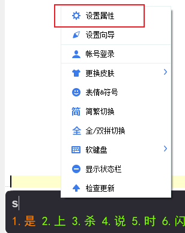
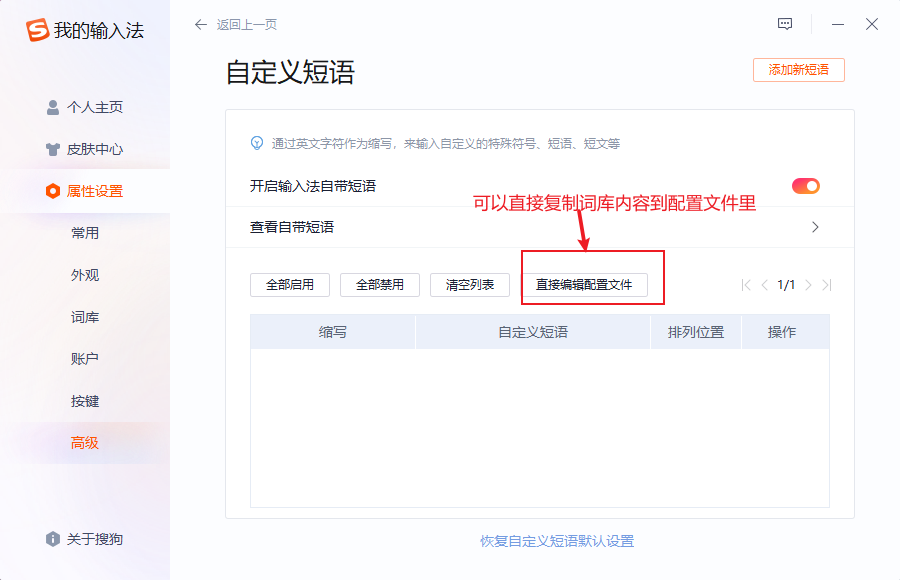
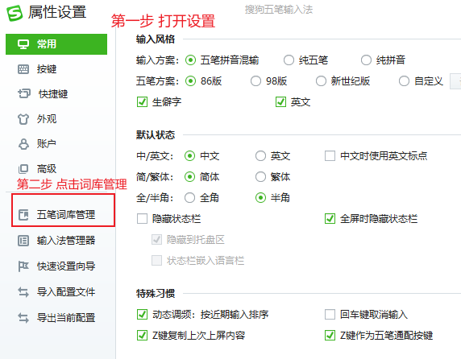
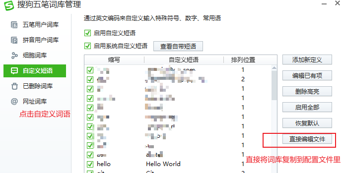
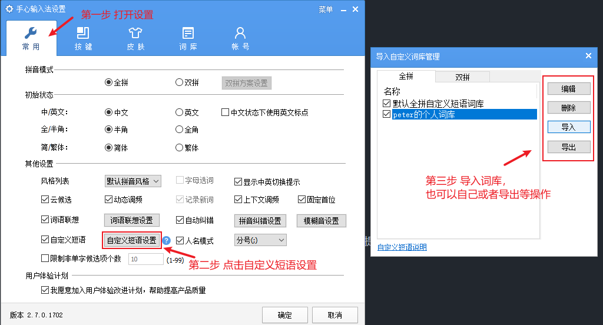
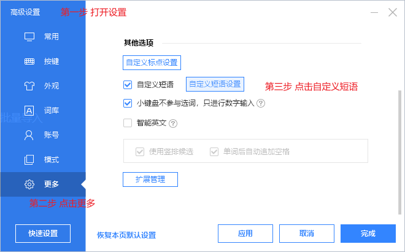
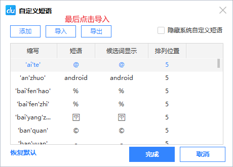
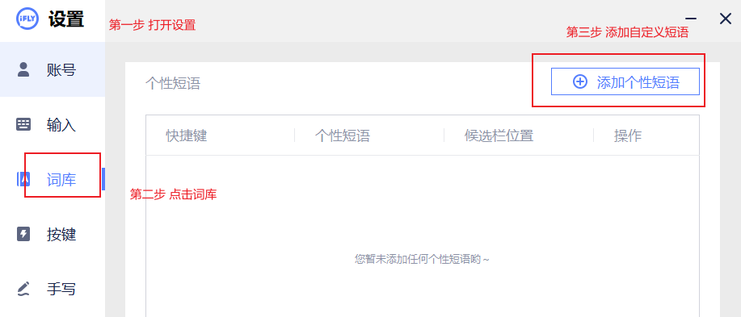
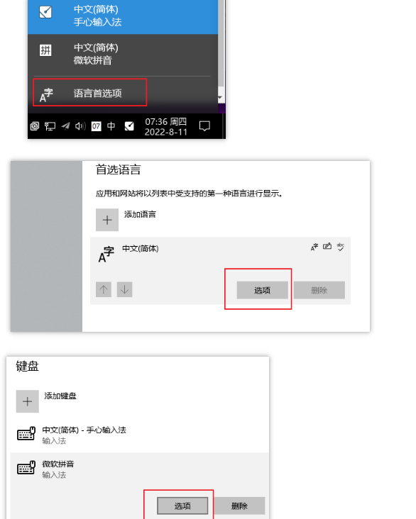
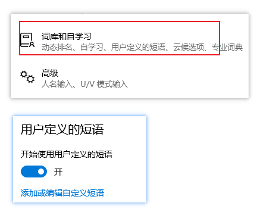

# 词库thesaurus

在日常生活中，计算机相关的名词通常都是大写开头的，例如Java，Maven，HTML等；而输入法没有这么智能，安装的词库也没记录这么多的术语；当我输入java的时候，并不会帮忙首字母大写等等，在日常沟通或者写博客时，如果用这些非大写的词语，显得不专业，也不好看。

因此，本项目记录一些日常生活中经常用到的计算机相关名词，用于导入到输入法词库中，方便平时使用。因本人接触的技术栈较少（主要是JavaWeb），其他编程语言的词库较为简单。欢迎补充。

每个txt文件名表明了是哪个语言（或者领域）的词库。

## 词库格式

大部分词库的格式如下：

```
```


## 输入法如何导入词库

一般输入法的设置里面都自带导入自定义词语的功能。

如何打开设置：在打字的时候，在输入法上右键，可以看到类似设置的字眼




或者在输入法的状态栏里右键，也可以看到类似设置的字眼


### 搜狗系列输入法

  官网：https://shurufa.sogou.com  ，全平台支持





对于五笔输入法：[搜狗五笔输入法](https://wubi.sogou.com/)







### 手心输入法

  官网http://www.xinshuru.com/，全平台支持




### 百度输入法

官网：[百度输入法 - 首页](https://shurufa.baidu.com/)  全平台支持







### 讯飞输入法

暂不支持批量导入，只能一个个添加




## RIME输入法

官网：[RIME | 中州韻輸入法引擎](https://rime.im/)

配置较为复杂，没有可视化页面配置，具体参考官网或者一些教程： [小狼毫输入法自定义词库如何配置，只需要配好这三个文件_哔哩哔哩](https://www.bilibili.com/video/BV1PT4y1z7ig/?vd_source=75da020020273864e366b53a452c8ad9)


### 微软输入法

暂不支持批量导入自定义词语（txt格式），导入导出是dat格式的文件







### 对于手机端的输入法

对于其他输入法：如果是本文档中没提到的输入法并且支持导入词库的，欢迎补充


## 支持本项目

如果想要扩充词库：

* 提issue
* fork本项目


想要扩充文档中没提到的输入法

* 提issue，并附上官网链接
* fork本项目


如果觉得项目不错：

* 可以考虑star一下
* 和朋友推荐下


本仓库地址：

Gitee：[Thesaurus ](https://gitee.com/peterjxl/thesaurus)

GitHub： [Thesaurus](https://github.com/Peter-JXL/thesaurus)


## 未来

可以考虑和咨询一些输入法厂商，使其可以直接在输入法词库里导入本项目中的词库


